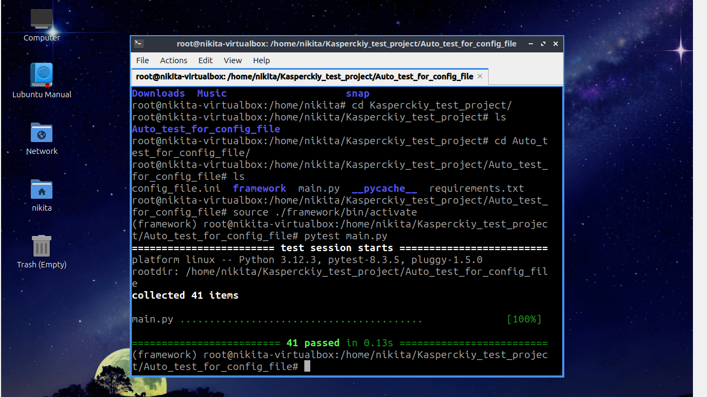
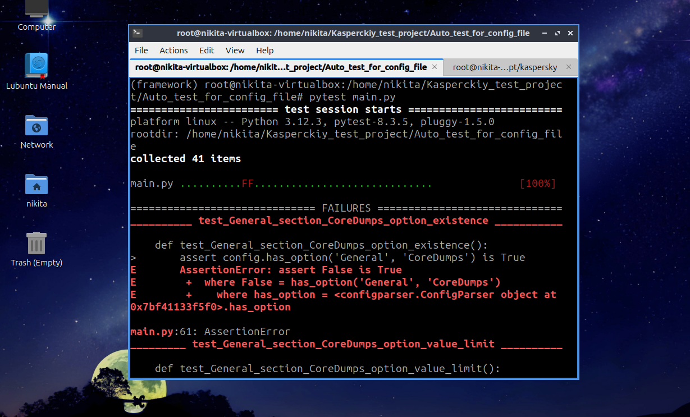
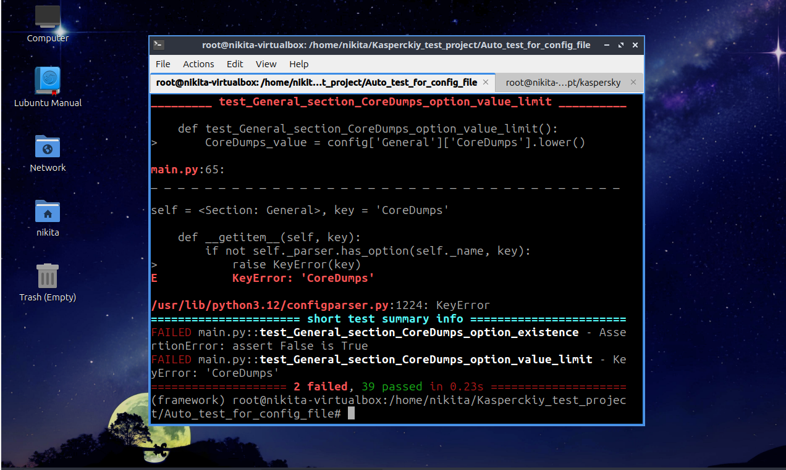

# В этом проекте находятся тесты, написанные с помощью библиотеки Pytest, для конфигурационного файла вида config.ini

## Для запуска тестов

### Проект протестирован на Ubuntu 24.04.2 LTS и инструкция предоставлена для этого же дистрибутива

    1. Необходимо убедиться, что на машине установлен Python версии 3.12.3. Все команды далее нужно проводить в режиме root пользователя

    2. Необходимо обновить индекс пакетов командной:
        sudo apt update && sudo apt upgrade -y
    
    3. Необходимо установить python3-pip командой:
        sudo apt install python3-pip -y
    
    4. Необходимо установить python3-venv командой:
        sudo apt install python3-venv -y
    
    5. Перейдите в директорию, где хотите расположить проект

    6. Клонируйте туда репозиторий командой:
        git clone https://github.com/Nik3SK/Auto_test_for_config_file.git
    
    7. Далее создайте окружение под названием framework в данной директории командой:
        python3 -m venv framework
    
    8. Активируйте окружение командой
        source ./framework/bin/activate

    9. Установить все необходимые библиотеки Python командой:
        pip install -r requirements.txt
    
    10. Конфиг файл, должен быть идентичным файлу config_file.ini по структуре. Сам конфигурационный файл, который нужно протестировать, должен располагаться по пути:
        /var/opt/kaspersky/config.ini
    
    
    11. Для запуска тестов запустите команду:
        pytest ./tests/main.py

## Артефакты, подтверждающие работу проекта

    Если config.ini полностью соотвествует стандрату, описанному в ТЗ, то будет следующий результат:

    Уберем в config.ini опцию CoreDumps в секции General, получаем:

